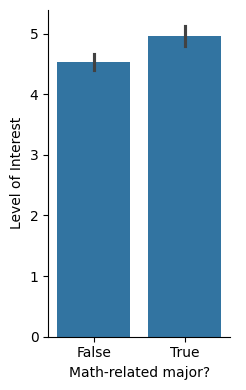
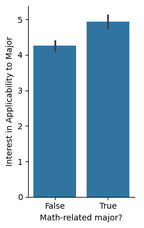
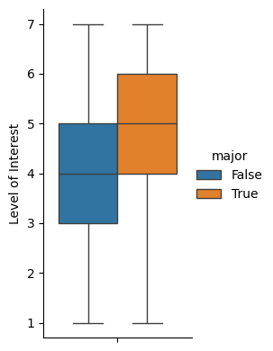
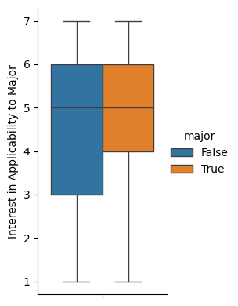
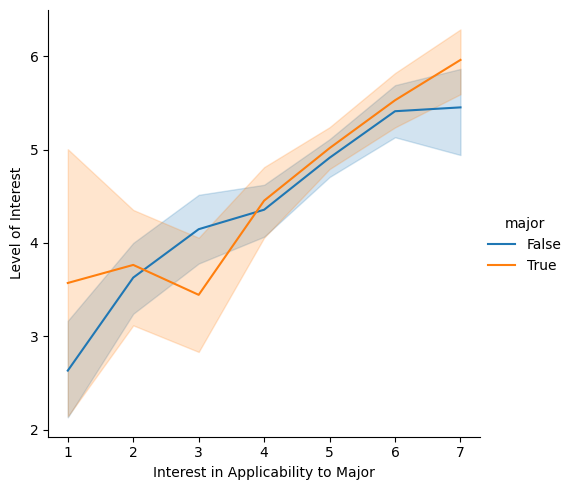

---
# Do not edit the text between these lines!
layout: default
---

# Yo, what's up Diggity Dawgs. I just made a mess in the other room. Here is the mess

<!-- This is a comment. Below, you'll see code for inserting an image. To make this image appear, update <custom-path>. To add an image, save it inside the imgs folder of this repository. -->

## Background
Suggestion: Some examples should be pulled from professors'/TAs' projects because the content better represents real-world applications and would engage students who happen to be interested in the instructor's field.

Justification: It reflects the questions about whether the students find the course & connections between compsci and other fields interesting. This idea also helps students find uses for Python later in their career if they are exposed to the ways instructors (especially non-compsci TAs) incorporate it into their work.

## Hypotheses
Students with non-math-related majors show less interest in the content itself ("interest") or possible applications of coding to their fields of interest ("connections interest"). Additionally, interest and connections interest are positively correlated, demonstrating that exposing students to a wider variety of applications more related to their careers/majors may increase overall interest in course content.

## Analyses

We imported the student surveys, converted the "interesting" and "interested_connections" columns into integers, and converted majors into True (math related) or False (not related). Here is the list of majors that would become True:
`Applied Sciences, Applied Physical Sciences, Biomedical Engineering, Biostatistics, Computer Science, Data Science, Economics, Information Science, Mathematics, & Statistics and Analytics.`

Next, we visualized the data:
Figure 1a and 1b. Bar graphs showing whether having a math-related major significantly impacts the levels of interest

Figure 1a shows that math-related majors have possibly more interest than non-math-related majors. Figure 1b shows that non-math-related majors have less interest in connections to their field, as shown by the significantly different bars.

Figure 2a and 2b. Box and whiskers plots comparing levels of interest for math- and non-math-related majors

Figure 2a shows that math-related majors have a higher level of interest than non-math-related majors (higher median and third quartile).
Figure 2b shows that math-related majors are more likely to report higher-levels of major-related interest (similar medians but tighter spread of data with higher scores).

Figure 3. Line graph showing the relationship between interested_connections and interest for math-related majors and non-math-related majors

There is a positive correlation between major-related interest (interested_connections) and overall interest (interest) for both math and non-math-related majors. There seems to be a more significant correlation for non-math-related majors.

# Conclusion 
There is a positive correlation between major-related interest and overall course interest, and math-related majors tend to show more of each type of interest. Therefore, it may be helpful to expose future students to more real-life examples of how coding can be applied to a wider variety of fields so that those with more diverse interests can develop a stronger appreciation of course content.

This is basic paragraph text.